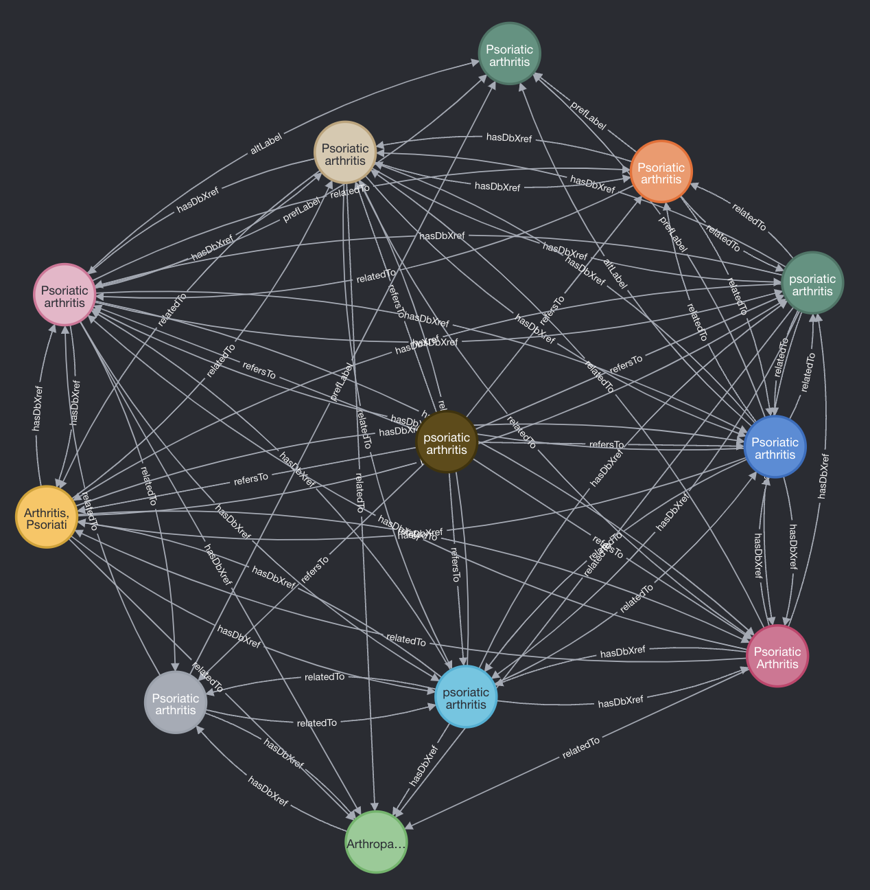

# DISCO


DISCO (or DISease COnsolidation) aims to aggregate different disease ontologies, generate cross-references among them, and create a common disease terminology that can reference to all others. DISCO terminology provides a quick way to harmonize and connect data from different aspects of healthcare and life science research. Real-world evidence (RWE), electronic health record (EHR) can now connect with biomedical and clinical research data via a common disease terminology. DISCO is currently published as a docker image and can be consumed by other applications. 

<b><u>FIND DOCKER IMAGE HERE: https://hub.docker.com/repository/docker/duncanhmdam/disco/</u></b>

## A. SOURCES

DISCO contains terms from the following medical terminologies:
- Disease Ontology (DO)
- The Experimental Factor Ontology (EFO)
- Human Phenotype Ontology (HPO)
- International Classification of Diseases, 9th Edition (ICD9CM)
- International Classification of Dieases, 10th Edition (ICD10CM)
- International Classification of Disease, 11th Edition (ICD11)
- International Classification of Disease Oncology, 3rd Edition (ICDO-3)
- Kyoto Encyclopedia of Genes and Genomes (KEGG)
- Medical Dictionary for Regulatory Activities (MedDRA)
- MedGen
- Medical Subject Headings (MeSH)
- Monarch Disease Ontology (MonDO)
- National Cancer Institue (NCIT)
- Orphanet 
- Phenome-wide association study (PheCode)
- Systematized Nomenclature of Medicine Clinical Terms (SNOMEDCT)
- Unified Medical Language System (UMLS)

Specific details of each source can be found <u><b>[here](./resources/source_urls.md)</b></u>

## B. DATA MODEL

DISCO application contains a Neo4j graph database and a Neo4j browser where CYPHER query can be executed. The current version of the DISCO database contains over 2.1 million nodes and ~4.3 million relationships. 

- Each node (except for DISCO and SYNONYM node type): 
  - has `name`, `source` and `source_id` as attributes
  - has at least one `prefLabel` relationship with SYNONYM node
  - has at least one `altLabel` relationship with SYNONYM node(s)
  - may have `subClassOf` relationship with other terms of the same label
  - has `hasDbXref` relationship(s) with other terms. These relationships are extracted directly, curated and officially confirmed by the sources
  - has `relatedTo` relationship(s) with other terms. These relationships are secondly derived from the sources (source code [here](./src/knowledge_graph/stage_2/stage_relatedTo_rel.clj))

- DISCO node
  - has `name`, `source`(=DISCO), `source_id`, list of `synonyms` as attributes
  - has at least one `refersTo` relationship with other non-DISCO terms

- SYNONYM node
  - has `name` as an attribute

## C. HOW TO
The following instruction helps users to spin up DISCO graph database locally

- Requirements:
  - Docker
  - DockerHub Account
- Find Docker Image: <https://hub.docker.com/repository/docker/duncanhmdam/disco/>
- In a shell terminal, create a `disco` folder
  ```sh
    mkdir disco
    cd disco
  ```
- Create `Dockerfile`
  ```sh
    touch Dockerfile
  ```
- Copy the following content into Dockerfile
  ```dockerfile
    FROM duncanhmdam/disco:latest
  ```
- Create `docker-compose.yml`
  ```sh
    touch docker-compose.yml
  ```
- Copy the below content into `docker-compose.yml`
  ```yaml
    version: '3'
    services:
      neo4j:
        build:
          context: .
          dockerfile: Dockerfile
        environment:
          # set the neo4j auth
          - NEO4J_AUTH=$NEO4J_USER/$NEO4J_PASS
        ports:
          # HTTP
          - 7474:7474
          # BOLT
          - 7687:7687
  ```
- Export credentials
  ```sh
    export NEO4J_USER=neo4j
    export NEO4J_PASS=test
  ```
- Run `docker-compose up` to spin up docker container
- Access Neo4j browser locallly at <http://localhost:7474/browser/>

## D. Resources
- [CYPHER](https://neo4j.com/developer/cypher/)
- [NEO4J](https://neo4j.com/)
- [DOCKER-HUB](https://hub.docker.com/repository/docker/duncanhmdam/disco/)